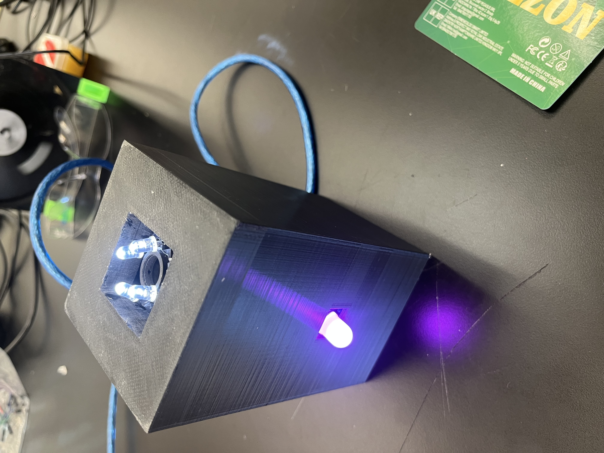
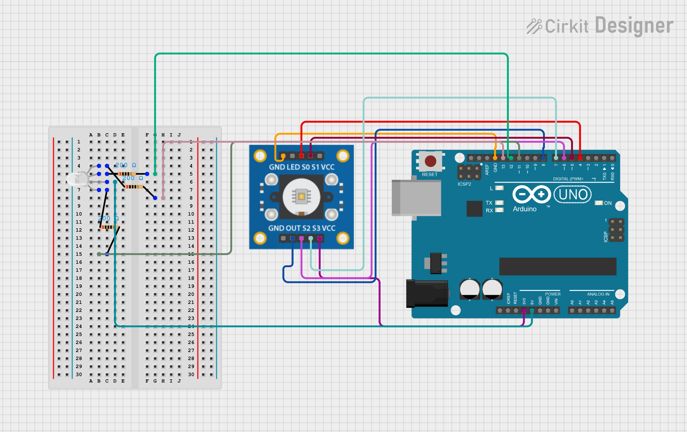

# Chameloen Light Project
My project is a color copying light. It has a sensor to detect color intensities and a light to display the color that the sensor detects. I was able to construct a working prototype quite quickly. After that I started making a cover for my wires and started solderng my bread board components to my perf board. After my perf board was finished, I had to make a case for my wires. After finsihing the case. I had to fit everything in and hot glue some compenenets to the case for stability. 

| **Engineer** | **School** | **Area of Interest** | **Grade** |
|:--:|:--:|:--:|:--:|
| Enzo L | Stratford Prepatory Blackford | Building things | Becoming a 7th grader



  
# Final Milestone

**Don't forget to replace the text below with the embedding for your milestone video. Go to Youtube, click Share -> Embed, and copy and paste the code to replace what's below.**

<iframe width="560" height="315" src="https://www.youtube.com/embed/F7M7imOVGug" title="YouTube video player" frameborder="0" allow="accelerometer; autoplay; clipboard-write; encrypted-media; gyroscope; picture-in-picture; web-share" allowfullscreen></iframe>

  In my third milestone, I am making a cover for my components to make it more compect and make it look better. My bioggest challenge was soldering all my components to my perf board beacause it took a long time. Also, I had to  make sure all my compoenents were in the right place was a challenge too. I learned not to touch soldering irons and hot glue at Bluestamp engineering. One of my biggest triumphs here at bluestamp was finsihing my project. It was particulary triumpanh because it took me three weeks and I had to go through a few prototypes and update my code a bunch of times. In the end, I finshed my project and it works(kinda). I hope to learn how code better with C++ in the future. 


# Second Milestone

**Don't forget to replace the text below with the embedding for your milestone video. Go to Youtube, click Share -> Embed, and copy and paste the code to replace what's below.**
<iframe width="560" height="315" src="https://www.youtube.com/embed/C68aiMfK0iA?si=g2nYTXVSGvlEuQtz" title="YouTube video player" frameborder="0" allow="accelerometer; autoplay; clipboard-write; encrypted-media; gyroscope; picture-in-picture; web-share" referrerpolicy="strict-origin-when-cross-origin" allowfullscreen></iframe>
Now, I have put my LED lights in on my bread board, and they work. They trun on whenever one color intensity is detcted to be higher than the others. The color with the higehr intensity turns on its respective light. I am suprised at how easy the project was because i though it was going to be really hard to finish. But now I am like halfway done. I had a big problem making sure my LEDs truned on when they were called and now when they were called, since previously my LED lights just stayed on forever. Before my final milestone, I want to find a way to make my LEDs brighther since i am currently using these tiny lights that like tickle the darkness. Also, I would like to add a protective cover and a way to hold my color sensor steady even when moving.

# First Milestone

<iframe width="560" height="315" src="https://www.youtube.com/embed/jrc51B8nUoc?si=41Jk99RhZdRDP0GL" title="YouTube video player" frameborder="0" allow="accelerometer; autoplay; clipboard-write; encrypted-media; gyroscope; picture-in-picture; web-share" referrerpolicy="strict-origin-when-cross-origin" allowfullscreen></iframe>
 
  So far, I have assembled my color sensor. I wired it up to my UNO board, which provides power for the sensor and its four lights and recieves inputs. I faced some challenges getting all the wires right and making sure the sensor worked porperly. My main challenge, though, was making sure my color sensor was getting all the right inputs. My code was restricting mhy sensor to only detect color intensities of 25, 72, and 255. I had to update my code to allow my color sensor to detect all color intensities. I think i will have to add my RGB LED lights and a cover for my project.
# Schematics 
 My UNO blard draws power than it turns on my LED and color sensor. The color sensor detects and saves the color of its environment. It then changes the RGB LED to the respective color.

# Code

```c++
#include <Adafruit_NeoPixel.h>  
#ifdef __AVR__  
#include <avr/power.h>  
#endif  
   
 // Which pin on the Arduino is connected to the NeoPixels?  
#define PIN      9  
   
 // How many NeoPixels are attached to the Arduino?  
#define NUMPIXELS 5  
   
Adafruit_NeoPixel pixels = Adafruit_NeoPixel(NUMPIXELS, PIN, NEO_GRB + NEO_KHZ800);  
   
int delayval = 333; // delay  
 int redraw = 0; 
 int greenraw = 0;
 int blueraw = 0;
#define S0 4
#define S1 5
#define S2 6
#define S3 7
#define sensorOut 8
 
int frequency = 0;
int Red, Green, Blue;
 
void setup() {


  pinMode(S0, OUTPUT);
  pinMode(S1, OUTPUT);
  pinMode(S2, OUTPUT);
  pinMode(S3, OUTPUT);
  pinMode(sensorOut, INPUT);
  pinMode(12, OUTPUT);
  pinMode(13, OUTPUT);
  pinMode(11, OUTPUT);
 
  // Setting frequency-scaling to 20%
  digitalWrite(S0,HIGH);
  digitalWrite(S1,LOW);
 
  Serial.begin(9600);
  pixels.begin(); // This initializes the NeoPixel library.  
}
 
void loop() {
  // Setting red filtered photodiodes to be read
  digitalWrite(S2,LOW);
  digitalWrite(S3,LOW);
  // Reading the output frequency
  frequency = pulseIn(sensorOut, LOW);
  //Remaping the value of the frequency to the RGB Model of 0 to 255
  //frequency = map(frequency, 25,72,255,0); 
  
  //if (frequency < 0) {
  //  frequency = 0;
 // }
  //if (frequency > 255) {
  //  frequency = 255;
  //}
  Red= frequency;
  // Printing the value on the serial monitor
  Serial.print("R= ");
  //printing name
  redraw = frequency;
  redraw = redraw - 49;

  Serial.print(redraw);//printing RED color frequency
  Serial.print("  ");
  delay(100);
 
  // Setting Green filtered photodiodes to be reawd
  digitalWrite(S2,HIGH);
  digitalWrite(S3,HIGH);
  // Reading the output frequency
  frequency = pulseIn(sensorOut, LOW);
  //Remaping the value of the frequency to the RGB Model of 0 to 255
  //frequency = map(frequency, 30,90,255,0);
  //if (frequency < 0) {
  //  frequency = 0;
  //}
  //if (frequency > 255) {
  //  frequency = 255;
  //}
  Green = frequency;
  // Printing the value on the serial monitor
  Serial.print("G= ");//printing name
  greenraw = frequency;
  greenraw= greenraw - 49;
  
  Serial.print(frequency);//printing RED color frequency
  Serial.print("  ");
  delay(100);
 
  // Setting Blue filtered photodiodes to be read
  digitalWrite(S2,LOW);
  digitalWrite(S3,HIGH);
  // Reading the output frequency
  frequency = pulseIn(sensorOut, LOW);
  //Remaping the value of the frequency to the RGB Model of 0 to 255
  //frequency = map(frequency, 25,70,255,0);
  //if (frequency < 0) {
  //  frequency = 0;
  //}
  //if (frequency > 255) {
  //  frequency = 255;
  //}
  Blue = frequency;
  // Printing the value on the serial monitor
  Serial.print("B= ");//printing name
  blueraw = frequency;
  blueraw = blueraw - 44;
 
 digitalWrite(13, LOW);
 digitalWrite(11, LOW);
 digitalWrite(12, LOW);
  

  Serial.print(frequency);//printing RED color frequency
  Serial.println("  ");
  pixels.setPixelColor(0, pixels.Color(Red,Green,Blue)); // Moderately bright green color.
  pixels.setBrightness(64);  
  pixels.show(); // This sends the updated pixel color to the hardware.
  delay(100);
  frequency= pulseIn(sensorOut, LOW);
  Serial.print("Raw rgb value");
  Serial.print(frequency);
  Serial.print(" This color is: ");
  delay(1000);
  if (Red == 0 && Green == 0 && Blue == 0) {
    Serial.println("Black  "); 
  }


  if (redraw > blueraw && redraw > greenraw) {
    digitalWrite(11, HIGH);
  }
  else if (blueraw > redraw && blueraw > greenraw) {
    digitalWrite(13, HIGH);
  }
  else if ( greenraw > blueraw && greenraw > redraw) {
    digitalWrite(12, HIGH);
  }

  else {
    digitalWrite(13, LOW);
    digitalWrite(12, LOW);
    digitalWrite(11, LOW);
  
  }
}
```

# Bill of Materials
Here's where you'll list the parts in your project. To add more rows, just copy and paste the example rows below.
Don't forget to place the link of where to buy each component inside the quotation marks in the corresponding row after href =. Follow the guide [here]([url](https://www.markdownguide.org/extended-syntax/)) to learn how to customize this to your project needs. 

| **Part** | **Note** | **Price** | **Link** |
|:--:|:--:|:--:|:--:|
| Uno Board | This is bascially my cpu | $20.70 | <a href="https://www.amazon.com/Arduino-A000066-ARDUINO-UNO-R3/dp/B008GRTSV6/"> Amazon Link </a> |
| Arduino color sensor | Detects color intensity | $16 | <a href="https://www.amazon.com/Arduino-A000066-ARDUINO-UNO-R3/dp/B008GRTSV6/"> Link </a> |
| Jumper wires | Connects components and carries electricty | $9 | <a href="https://www.amazon.com/Arduino-A000066-ARDUINO-UNO-R3/dp/B008GRTSV6/"> 
| Bread board | Helpful for connect my LED lights to my Uno board | $6.50 | <a href="https://www.amazon.com/Arduino-A000066-ARDUINO-UNO-R3/dp/B008GRTSV6/">
| Perf Board | Used for soldering my compennets to make it my stuff more compect | $5.00 | <a href="https://www.amazon.com/Arduino-A000066-ARDUINO-UNO-R3/dp/B008GRTSV6/">


# Other Resources/Examples
- [Electric Chameleon with Arduino](https://www.circuits-diy.com/electronic-chameleon-arduino/#google_vignette)
- [Arduino Blink Code](https://docs.arduino.cc/built-in-examples/basics/Blink/)
- [Onshape Cading software](https://cad.onshape.com/documents/d0065ab7d55b9036e3234d8b/w/4aa930961465e979f6b4daca/e/80b4e087bca822ffd074f486)
